# What's new in Xtext and Xtend 2.14 #
## The journey of Tim Toolsmith
Tim Toolsmith is one of those typical developers.
He loves to code in the office, on the train, during a long flight or even while sitting on his sunny terrace during his vacation.
Tim takes great pleasure in using the latest programming languages, frameworks, and IDEs for manufacturing innovative solutions.
Essential parts of his toolbox are Xtext and Xtend which he uses to tailor domain-specific languages for a wide variety of usage scenarios.
However, the last two releases of Xtext and Xtend have been difficult for Tim, since they were mainly concerned with bug fixes and internal performance improvements and offered only a limited amount of cutting-edge features.
The good news for Tim is that the 2.14 release comes with a whole bunch of new features and support for the latest framework versions Xtext and Xtend are build upon.
So join Tim's journey to explore the new Xtext and Xtend features.

## An Evolved Foundation
Since Tim is a classic early adopter he is always using the latest Java version.
Therefore, Tim is really excited about the 2.14 release since it comes with the ability to compile with and against Java 9 & 10.
Of course, he is aware of the prerequisites and restrictions:

- Currently, there is no native support for Java 9/10 
- A current Maven version (has been tested with 3.5) 
- Gradle must be at least version 4.7
- Java 9 requires Tycho 1.1 or newer and Java 10 requires Tycho 1.2
- Java 9 with at least Oxygen.1a and Java 10 with at least Oxygen.3a (As an early adopter, Tim, of course, goes for Eclipse Photon that works for both)
- Java 10 requires `org.objectweb.asm` library in version 6.1.1

After realizing that fulfilling all the prerequisites is a piece of cake for him, he discovers another great feature.
Xtext 2.14 ships with support for JUnit 5 which itself comes with a lot of [new features](https://junit.org/junit5/docs/snapshot/release-notes/index.html).
Tim is very delighted to see that the project wizard was updated accordingly.
Moreover, the projects created by the wizard only depend on the JUnit 5 artifact (`org.junit.jupiter:junit-jupiter-api:5.0.0`).
Thereby, all dependencies are configured by the JUnit library container which lowers the coupling to concrete JUnit versions.

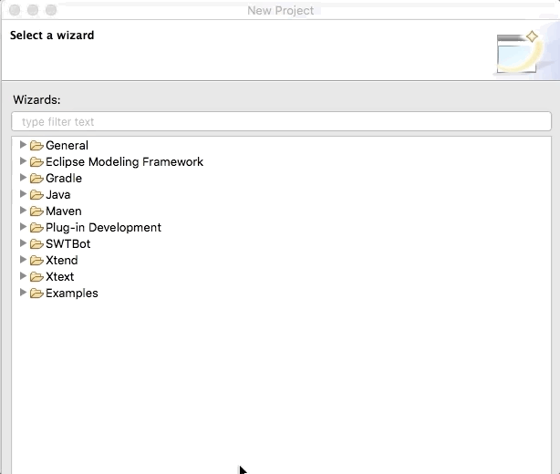

Before continuing his journey, he reminds himself to remember this [blog post](https://blogs.itemis.com/en/xtext-2.14-adds-support-for-junit-5) which offers interesting details on the JUnit 5 integration.

## Exploring the Grammar Enhancements
After updating the technical foundation, Tim is excited to see what Xtext 2.14 offers for the foundation of every Xtext language - the grammar.
He is very happy to see that Xtext 2.14 comes with a `@Deprecated` annotation which Tim missed from the beginning.

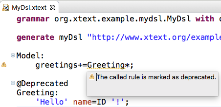

In addition, he is grateful for being able to customize the severity of the message displayed when referring to a deprecated rule through the Xtext preference page.

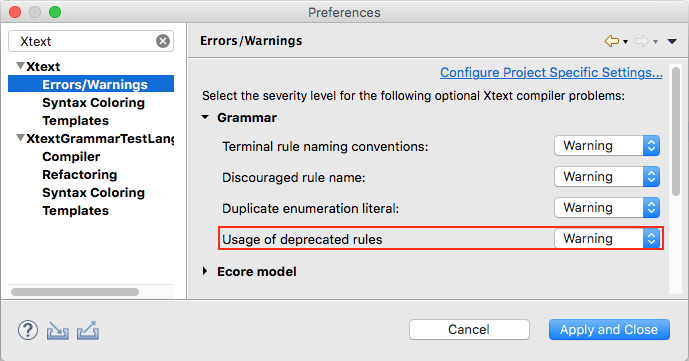

Tim is even more delighted to see that with the `@Final` annotation it is now possible to prevent certain rules from being overwritten.
 
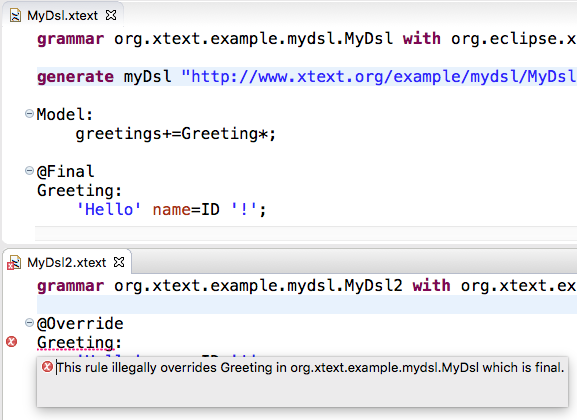

The third new grammar feature that attracts Tim's attention is the brand-new `@Exported` annotation.
If Tim wanted to export features to the index in the past, he had to manually come up with an `IDefaultResourceDescriptionStrategy` implementation.
Now using the `@Exported` annotation will generate the basic infrastructure to publish custom objects to the index.
All Tim has to keep in mind is that only those grammar rules annotated with `@Exported` will be available on the index. 

## Examining the Eclipse Integration
Having tested the new grammar features Tim is thrilled to see what enhancements were made regarding the Eclipse integration.

At first sight, he cannot believe what he is seeing.
After two releases of only a few new features, he finally found something that makes his early adapter heart beat faster.
Xtext 2.14 is one of the first to integrate the newly introduced *Code Mining* feature.
The API allows Tim to add additional semantic information into the text, which is not part of the text itself.
Tim thoughts start to run.
There are so many situations in which he can leverage *Code Mining*.

- Show the inferred return type of a function based on its content.
- Display parameter names in the context of a function call.
- Present the number of incoming or outgoing references of a method
- ....

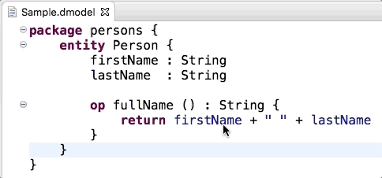

Tim only has to add the `org.eclipse.xtext.xtext.generator.ui.codemining.CodeMiningFragment` to his generator workflow and all the required dependencies and a stub implementation will be added to his Xtext project.
Tim also realizes that there is a [blog post](https://blogs.itemis.com/en/code-mining-support-in-xtext) providing more details on how to leverage code mining.
But before he jumps right in to get his hands dirty, he wants to continue his journey of exploring all the new Xtext features.

While inspecting the next feature Tim realizes that he took the right decision.
Xtext 2.14 ships with support for specifying "New Project" and "New File" wizards without the need to write tons of SWT code.
Tim only has to add two simple modules to his generator workflow and the infrastructure encapsulating the UI implementation for creating Eclipse projects and files for his specific DSL is generated.

	language = StandardLanguage {
		name = "org.xtext.example.mydsl.MyDsl"
		fileExtensions = "mydsl"
		    
		fileWizard = {
		    generate = true
		}
		projectWizard = {
		    generate = true
		}
	}	

Instead of fiddling around with SWT widgets, the user interface for "New Project" and "New File" wizard can be defined using a concise API.
Moreover, the API allows Tim to specify the structure of the projects and the content of the files with so-called templates.

Based on the descriptions seamlessly integrated wizards will be provided in the runtime.
The wizard to create projects, for example, allows selecting from the templates specified by Tim.

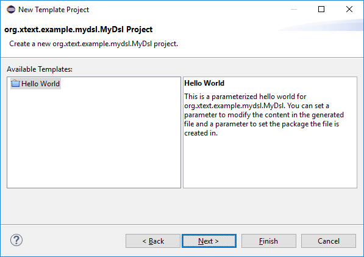

The wizard to create files is more simple in its basic form and skips the template selection if there is - as in most cases - only one file template.

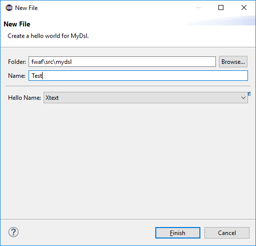

At this point, Tim realizes that the number of new features in Xtext 2.14 is overwhelming.
So before he continues to inspect the other cool new stuff, he notes the blog posts for the ["New Project"](https://blogs.itemis.com/en/generating-a-new-project-wizard-with-xtext-2.14) wizard and the ["New File"](https://blogs.itemis.com/en/new-file-wizard-easy-to-generate-with-xtext-2.14) wizard which provide more detailed information on the matter.

Continuing his exploration of new Xtext features he discovers the Create Action Quickfix.
Tim knows from a lot of situations like the one displayed underneath. 
Grammar rules that can be consumed without object instantiation usually require a *Create Action*.
For example, a grammar rule that only contains an optional assignment will be marked with a warning message by the Xtext editor.
Tim is really glad that with Xtext 2.14 the warning message is enhanced by a quick fix that automatically inserts the proper *Create Action*. 

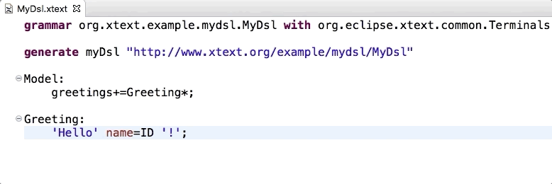

Although Tim has witnessed a lot of large new features, he still has an eye for the detail.
While experimenting with the new Xtext 2.14 he realizes that the Xtext Build console finally got a proper icon.

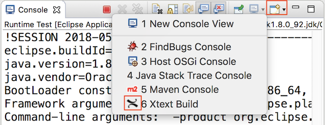

## Accelerating Tims journey
Tim as a passionate Xtext user implements domain-specific language workbenches at an industrial scale.
Therefore, Tim is euphoric about the performance improvements incorporated in Xtext 2.14.
One pain point he experienced in the past was caused by the access to `IOutputConfiguration` from the builder participant.
The problem that depends on the number of files produced by code generators is now fixed by cache implementation within the `BuilderParticipant`.

Further, the improvements for `QueuedBuiledData` regarding build times for a large number of resources will increase performance in Tims industry scale projects.
Finally, Tim is looking forward to the performance improvements made in the area of semantic highlighting.
He is keen to see the positive effects when editing large Xtend files.
Since time is thinking about Xtend, he decides to move on to the improvements made in release 2.14.

## What's new in Xtend - The journey continues
After going through all the new features and functions in Xtext, Tim is keen about the improvements included in Xtend 2.14.
Before he starts exploring the features in detail he notes with satisfaction that Xtend also supports Java 9 & 10.
Having secured that Xtend is built on the same solid foundation as Xtext, Tim takes a closer look at the Xtend compiler feature.

He quickly realizes that Xtend now supports Multi-Catch support. 
Multi-Catch support allows the handling of multiple Exception classes in a single catch block.

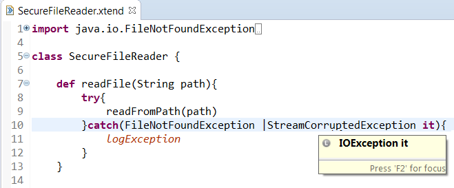

Given that Tim is an early adopter he found himself thinking: "Been there. Done that."
However, he has to admit that applying the same concept to the type guard expressions of switch statements is exactly the kind of syntactical sugar he loves about Xtend.

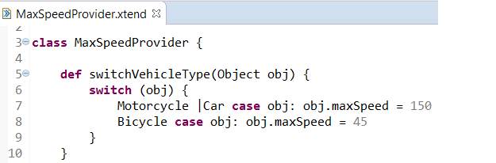 
 
Tim is a huge fan of the concise and semantically rich Xtend language.
Especially avoiding unnecessary modifiers, such as "public" or "final" is a feature he uses extensively.
However, every once in a while he falls back to old routines and explicitly specifies unnecessary modifiers.
Therefore, Tim is really grateful as he realizes that Xtend 2.14 now marks unnecessary modifiers and even better, offers a quick-fix to remove them.

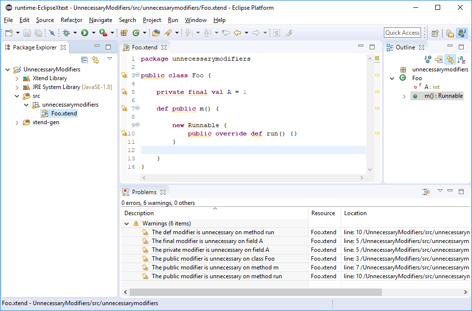 

Once again Tim is delighted to see that the severity for the unnecessary modifier markers can be customized through a preference page.
He quickly writes down the link to [this blog post](https://blogs.itemis.com/en/xtend-2-14-unnecessary-modifiers-validation) that describes the unnecessary modifier feature in more detail.

## One journey ends, but many more will follow!
Having explored all the interesting new features of Xtext and Xtend 2.14 Tim is excited to quickly use them all.
Before he leaves his laptop to grab another coffee and plan the next steps for leveraging the new features he realizes two changes in the Xtext team.
With Christian Dietrich [becoming co-project lead](https://blogs.itemis.com/en/becoming-xtext-co-project-lead)- after more than 10 years of supporting and enhancing Xtext the project envisions a prosper and feature-rich future.
Additionally, Arne Deutsch who added more than 60 pull requests in the last 12 month was [elected](https://projects.eclipse.org/projects/modeling.tmf.xtext/elections/election-arne-deutsch-committer-eclipse-xtext) as new committer by the Xtext team.
Witnessing the on-going support and commitment of all Xtext contributors reaffirms Tims wish to experience more journeys like the one he just finished.

## Start your own journey
If you find yourself thinking I would love to take a trip like Tim did, 
feel free to explore all the details of the Xtext 2.14 release starting from the [Xtext](https://www.eclipse.org/Xtext/releasenotes.html) or [Xtend](https://www.eclipse.org/xtend/releasenotes.html) release notes.
In case you are more of a guided tour person, you should watch the [webinar](https://www.youtube.com/watch?v=Isxverh09e4) held by the Xtext committers Karsten Thoms and Holger Schill.
Alternatively, if you want to add a social component to your journey and you happen to be around in Bonn on July 9th join the [Eclipse Demo Camp](https://wiki.eclipse.org/Eclipse_DemoCamps_2018/Bonn)- which will also have a focus on the Xtext 2.14 release.
